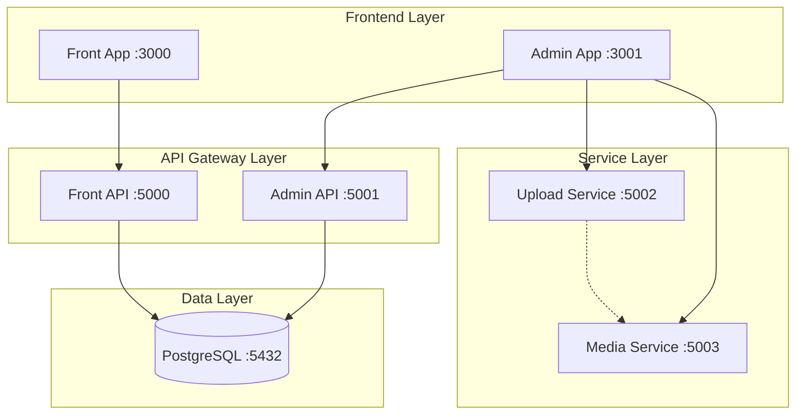

# DockerX Documentation

Welcome to the comprehensive documentation for DockerX - a microservices-based web application platform built with .NET 8, Next.js, PostgreSQL, and Docker.

## 📋 Table of Contents

### 🏗️ Architecture & Design
- [**System Architecture**](./architecture.md) - Complete system overview and microservices design
- [**Database Design**](./database.md) - PostgreSQL schema, migrations, and data models
- [**API Documentation**](./api.md) - Comprehensive API reference for all services

### 🚀 Services Documentation
- [**Frontend Applications**](./frontend.md) - Next.js applications (Public & Admin)
- [**Backend APIs**](./backend.md) - .NET Web APIs detailed documentation
- [**Upload Service**](./upload-service.md) - File upload and storage management
- [**Media Service**](./media-service.md) - Image processing with ImageFlow

### 🔧 Development & Deployment
- [**Development Setup**](./development.md) - Local development environment setup
- [**Docker Configuration**](./docker.md) - Containerization and orchestration
- [**Configuration Management**](./configuration.md) - Environment and service configuration
- [**Testing Strategy**](./testing.md) - Unit, integration, and end-to-end testing

### 🔐 Security & Authentication
- [**Authentication & Authorization**](./authentication.md) - JWT tokens, user management
- [**Security Best Practices**](./security.md) - File upload security, CORS, data protection

### 📊 Operations & Monitoring
- [**Deployment Guide**](./deployment.md) - Production deployment strategies
- [**Monitoring & Logging**](./monitoring.md) - Health checks, logging, and observability
- [**Performance Optimization**](./performance.md) - Scaling and performance tuning

### 🔧 Additional Resources
- [**Troubleshooting**](./troubleshooting.md) - Common issues and solutions
- [**Contributing Guidelines**](./contributing.md) - Development workflow and standards
- [**API Examples**](./api-examples.md) - Code samples and usage examples

## 🌟 Quick Start

For a quick start, see the [Development Setup Guide](./development.md).

## 🏗️ System Overview

DockerX is a modern, scalable web application platform featuring:

- **Microservices Architecture** with 6 specialized services
- **Multiple Frontend Applications** (Public & Admin interfaces)
- **JWT-based Authentication** for secure admin operations
- **Multi-Storage Support** (AWS S3, Azure Blob, Local)
- **Image Processing Pipeline** with ImageFlow
- **Real Database Integration** with PostgreSQL
- **Complete Docker Containerization**
- **Comprehensive Testing Strategy**

## 🚀 Services at a Glance

| Service | Port | Technology | Purpose |
|---------|------|------------|---------|
| **Front** | 3000 | Next.js 15 | Public interface for viewing posts |
| **Admin** | 3001 | Next.js 15 | Administrative management interface |
| **FrontApi** | 5000 | .NET 8 API | Public API for fetching posts |
| **AdminApi** | 5001 | .NET 8 API | Authenticated API for admin operations |
| **Upload** | 5002 | .NET 8 API | File upload and storage management |
| **Media** | 5003 | .NET 8 API | Image processing and serving |
| **Database** | 5432 | PostgreSQL 15 | Data persistence layer |

## 📊 Architecture Diagram

## 🛠️ Technology Stack

### Backend Services
- **.NET 8** - Web APIs with Entity Framework
- **PostgreSQL 15** - Primary database
- **JWT Authentication** - Secure token-based auth
- **Swagger/OpenAPI** - API documentation
- **ImageFlow** - High-performance image processing

### Frontend Applications
- **Next.js 15** - React framework with App Router
- **TypeScript** - Type-safe development
- **Tailwind CSS** - Utility-first styling
- **React Hooks** - Modern state management

### Infrastructure
- **Docker & Docker Compose** - Containerization
- **PostgreSQL** - Database with persistent volumes
- **Multi-stage Builds** - Optimized container images
- **Health Checks** - Service monitoring

### Storage & Media
- **AWS S3** - Cloud object storage
- **Azure Blob Storage** - Alternative cloud storage
- **Local File System** - Development storage
- **Shared Volumes** - Inter-service file sharing

## 📈 Key Features

### ✅ **Complete Implementation**
- All README requirements fulfilled
- Production-ready microservices
- Comprehensive testing coverage
- Docker containerization
- Health monitoring

### ✅ **Security Features**
- JWT token authentication
- File upload validation
- CORS configuration
- Secure storage options
- Input sanitization

### ✅ **Developer Experience**
- Hot reload development
- Comprehensive documentation
- Easy service management
- Type-safe interfaces
- Automated testing

### ✅ **Operational Excellence**
- Health check endpoints
- Centralized configuration
- Volume persistence
- Service isolation
- Scalable architecture

## 🚀 Getting Started

1. **Prerequisites**: Docker, .NET 8 SDK, Node.js 18+
2. **Clone Repository**: `git clone <repository-url>`
3. **Start Services**: `./scripts/start-all-services.ps1`
4. **Access Applications**: See [Development Setup](./development.md)

## 📞 Support

For detailed information on any aspect of the system, refer to the specific documentation files linked above. Each document provides comprehensive coverage of its respective area with examples, configurations, and best practices.

---

**Built with ❤️ using .NET 8, Next.js 15, PostgreSQL, and Docker** 