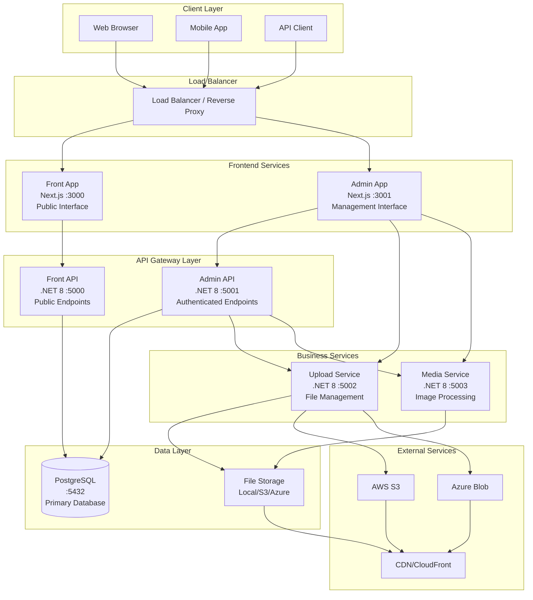
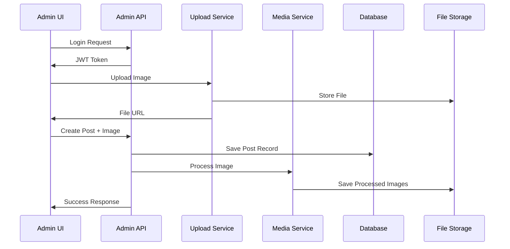
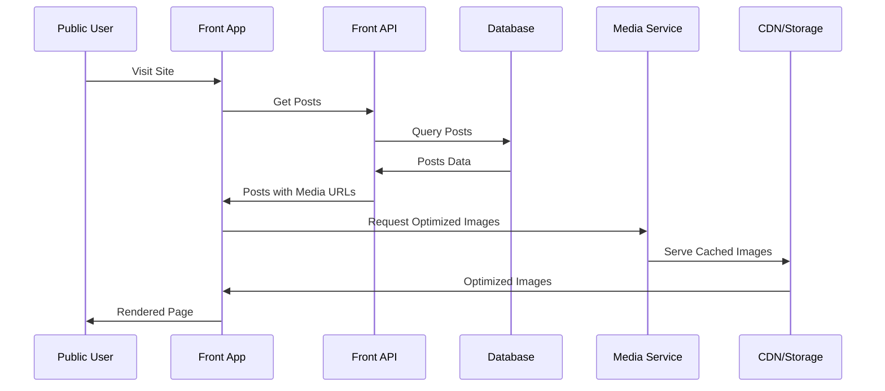
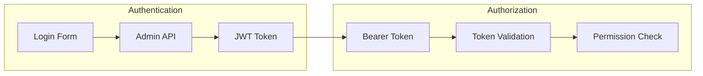

# System Architecture

## Overview

DockerX follows a **microservices architecture** pattern with clear separation of concerns, designed for scalability, maintainability, and independent deployment. The system consists of 6 core services orchestrated through Docker Compose.

## 🏗️ Architectural Principles

### **1. Microservices Design**
- **Single Responsibility**: Each service has a specific, well-defined purpose
- **Independent Deployment**: Services can be deployed and scaled independently
- **Technology Diversity**: Services can use different technologies as needed
- **Data Isolation**: Each service manages its own data domain

### **2. API-First Approach**
- **RESTful APIs**: Clear, consistent API design across all services
- **OpenAPI Documentation**: Swagger documentation for all endpoints
- **Versioning Strategy**: Built-in support for API versioning
- **Contract-First**: API contracts defined before implementation

### **3. Event-Driven Communication**
- **Loose Coupling**: Services communicate through well-defined interfaces
- **Asynchronous Processing**: File uploads and media processing
- **Shared Storage**: Inter-service communication through shared volumes

## 🌐 System Architecture Diagram



## 📊 Service Architecture Details

### **Frontend Layer**

#### **Front App (Public Interface)**
```typescript
Technology: Next.js 15 + TypeScript + Tailwind CSS
Port: 3000
Purpose: Public-facing interface for content consumption

Key Features:
- Server-side rendering for SEO
- Responsive design for all devices
- Error boundaries and retry logic
- Image optimization and lazy loading
- Static generation for performance
```

#### **Admin App (Management Interface)**
```typescript
Technology: Next.js 15 + TypeScript + Tailwind CSS
Port: 3001
Purpose: Administrative interface for content management

Key Features:
- JWT-based authentication
- Role-based access control
- Real-time form validation
- File upload with progress
- Dashboard analytics
- Content workflow management
```

### **API Layer**

#### **Front API (Public Endpoints)**
```csharp
Technology: .NET 8 Web API + Entity Framework
Port: 5000
Purpose: Public API for content retrieval

Endpoints:
- GET /api/posts           // All posts with pagination
- GET /api/posts/{id}      // Specific post details
- GET /api/posts/paged     // Paginated results
- GET /api/health          // Service health check

Features:
- Read-only operations
- High-performance caching
- Rate limiting protection
- CORS configuration
- Response compression
```

#### **Admin API (Authenticated Endpoints)**
```csharp
Technology: .NET 8 Web API + Entity Framework + JWT
Port: 5001
Purpose: Administrative operations with authentication

Endpoints:
- POST /api/auth/login      // JWT authentication
- GET  /api/adminposts      // Admin post management
- POST /api/adminposts      // Create posts with media
- PUT  /api/adminposts/{id} // Update posts
- DELETE /api/adminposts/{id} // Delete posts

Security Features:
- JWT token validation
- Role-based authorization
- Input validation
- SQL injection prevention
- XSS protection
```

### **Business Services**

#### **Upload Service (File Management)**
```csharp
Technology: .NET 8 Web API + Multi-Storage
Port: 5002
Purpose: File upload and storage abstraction

Storage Providers:
- AWS S3 (with encryption)
- Azure Blob Storage
- Local File System

Endpoints:
- POST /api/store/upload   // File upload with validation
- GET  /api/store/health   // Service health

Features:
- Multi-provider abstraction
- File type validation
- Size limits enforcement
- Virus scanning integration
- Upload progress tracking
- Resumable uploads
```

#### **Media Service (Image Processing)**
```csharp
Technology: .NET 8 Web API + ImageFlow
Port: 5003
Purpose: Image processing and optimization

Endpoints:
- GET  /api/media/image/{file}  // Serve with resize
- GET  /api/media/crop/{file}   // Crop functionality
- POST /api/media/process       // Process uploads

Features:
- Dynamic resizing
- Format conversion
- Quality optimization
- Watermark application
- EXIF data handling
- Progressive JPEG
```

## 🔄 Data Flow Architecture

### **Content Publishing Flow**



### **Content Consumption Flow**



## 🗄️ Data Architecture

### **Database Design**

```sql
-- Posts Table
CREATE TABLE posts (
    id UUID PRIMARY KEY DEFAULT gen_random_uuid(),
    title VARCHAR(255) NOT NULL,
    media_id UUID REFERENCES media(id),
    public_id SERIAL UNIQUE,
    json_meta JSONB,
    created_at TIMESTAMP DEFAULT NOW(),
    updated_at TIMESTAMP DEFAULT NOW()
);

-- Media Table
CREATE TABLE media (
    id UUID PRIMARY KEY DEFAULT gen_random_uuid(),
    aws_s3_path VARCHAR(500) NOT NULL,
    file_name VARCHAR(255),
    content_type VARCHAR(100),
    file_size BIGINT,
    created_at TIMESTAMP DEFAULT NOW()
);

-- Indexes for Performance
CREATE INDEX idx_posts_public_id ON posts(public_id);
CREATE INDEX idx_posts_created_at ON posts(created_at);
CREATE INDEX idx_media_s3_path ON media(aws_s3_path);
```

### **Storage Strategy**

```yaml
Storage Layers:
  Primary Database:
    - PostgreSQL for transactional data
    - JSON fields for flexible metadata
    - UUID primary keys for global uniqueness
    
  File Storage:
    - Local filesystem for development
    - AWS S3 for production (with encryption)
    - Azure Blob for multi-cloud strategy
    
  Caching Layer:
    - Redis for session storage (future)
    - CDN for static asset delivery
    - Database query result caching
```

## 🔒 Security Architecture

### **Authentication Flow**



### **Security Layers**

```yaml
Network Security:
  - HTTPS enforcement
  - CORS policy configuration
  - Rate limiting per endpoint
  - Request size limitations

Application Security:
  - JWT token validation
  - Input sanitization
  - SQL injection prevention
  - XSS protection headers

File Security:
  - File type validation
  - Size restrictions
  - Virus scanning integration
  - Secure file naming

Data Security:
  - Database encryption at rest
  - Sensitive data masking
  - Audit logging
  - Backup encryption
```

## 🚀 Scalability Architecture

### **Horizontal Scaling Strategy**

```yaml
Frontend Scaling:
  - CDN distribution
  - Static asset optimization
  - Service worker caching
  - Progressive loading

API Scaling:
  - Load balancer distribution
  - Stateless service design
  - Database connection pooling
  - Response caching

Storage Scaling:
  - Multi-region file storage
  - CDN edge locations
  - Database read replicas
  - Sharding strategies
```

### **Performance Optimization**

```yaml
Database Optimization:
  - Proper indexing strategy
  - Query optimization
  - Connection pooling
  - Read/write separation

Caching Strategy:
  - Browser caching
  - CDN caching
  - Application-level caching
  - Database query caching

Resource Optimization:
  - Image compression
  - Lazy loading
  - Code splitting
  - Bundle optimization
```

## 🔧 Deployment Architecture

### **Container Strategy**

```yaml
Containerization:
  Base Images:
    - .NET 8 Runtime (Alpine)
    - Node.js 18 (Alpine)
    - PostgreSQL 15
    
  Multi-stage Builds:
    - Optimized image sizes
    - Security vulnerability reduction
    - Build artifact separation
    
  Health Checks:
    - Service health endpoints
    - Database connectivity checks
    - External dependency validation
```

### **Orchestration**

```yaml
Docker Compose:
  Development:
    - Hot reload volumes
    - Debug port exposure
    - Local storage mounts
    
  Production:
    - Optimized configurations
    - Secret management
    - Health monitoring
    - Auto-restart policies

Future Kubernetes:
  - Pod auto-scaling
  - Service mesh integration
  - Rolling deployments
  - Resource quotas
```

## 📊 Monitoring Architecture

### **Observability Stack**

```yaml
Logging:
  - Structured logging (JSON)
  - Centralized log aggregation
  - Log level configuration
  - Error tracking integration

Metrics:
  - Application performance metrics
  - Business metrics tracking
  - Resource utilization monitoring
  - Custom dashboard creation

Tracing:
  - Distributed tracing setup
  - Request correlation IDs
  - Performance bottleneck identification
  - Dependency mapping
```

### **Health Monitoring**

```yaml
Health Checks:
  Endpoints:
    - /api/health (all services)
    - Database connectivity
    - External service availability
    - File storage accessibility
    
  Monitoring:
    - Automated health checking
    - Alert configuration
    - Failure notification
    - Recovery procedures
```

## 🔄 Integration Architecture

### **Inter-Service Communication**

```yaml
Synchronous:
  - HTTP/REST APIs
  - Request/response patterns
  - Circuit breaker patterns
  - Timeout configurations

Asynchronous:
  - Shared file storage
  - Event-driven processing
  - Queue-based communication (future)
  - Message broker integration (future)

Data Consistency:
  - Eventual consistency model
  - Saga pattern implementation
  - Compensation transactions
  - Idempotent operations
```

This architecture provides a solid foundation for a scalable, maintainable, and secure microservices platform that can grow with business requirements while maintaining high performance and reliability. 