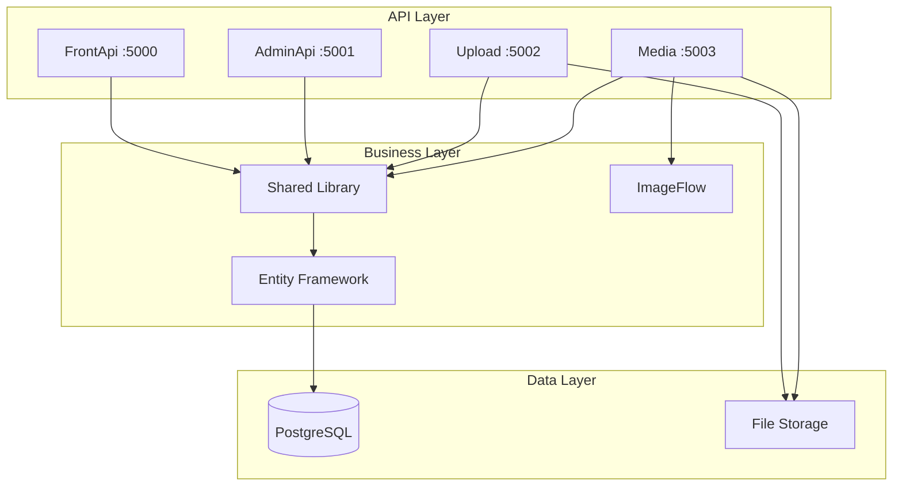

# Backend Services Documentation

## Overview

DockerX backend consists of four .NET 8 Web API services, each with specific responsibilities in the microservices architecture. All services follow clean architecture principles and implement best practices for scalability and maintainability.

## 🏗️ Backend Architecture

### **Services Overview**

| Service | Port | Purpose | Key Features |
|---------|------|---------|--------------|
| **FrontApi** | 5000 | Public content access | Post retrieval, pagination |
| **AdminApi** | 5001 | Admin operations | JWT auth, CRUD operations |
| **Upload** | 5002 | File management | Multi-storage support |
| **Media** | 5003 | Image processing | ImageFlow integration |

### **Architecture Diagram**



## 📦 Project Structure

### **Solution Organization**

```
DockerX/
├── src/
│   ├── Shared/                 # Shared library
│   │   ├── Models/            # Domain models
│   │   ├── Interfaces/        # Service contracts
│   │   ├── DTOs/              # Data transfer objects
│   │   └── Extensions/        # Extension methods
│   │
│   ├── FrontApi/              # Public API
│   │   ├── Controllers/       # API endpoints
│   │   ├── Services/          # Business logic
│   │   └── Program.cs         # Startup configuration
│   │
│   ├── AdminApi/              # Admin API
│   │   ├── Controllers/       # Admin endpoints
│   │   ├── Services/          # Admin services
│   │   ├── Middleware/        # Auth middleware
│   │   └── Program.cs         # Admin startup
│   │
│   ├── Upload/                # Upload service
│   │   ├── Controllers/       # Upload endpoints
│   │   ├── Services/          # Storage services
│   │   └── Program.cs         # Upload startup
│   │
│   └── Media/                 # Media service
│       ├── Controllers/       # Media endpoints
│       ├── Services/          # Image processing
│       └── Program.cs         # Media startup
│
├── tests/                     # Test projects
│   ├── Shared.Tests/          # Shared library tests
│   ├── FrontApi.Tests/        # Front API tests
│   ├── AdminApi.Tests/        # Admin API tests
│   ├── Upload.Tests/          # Upload service tests
│   └── Media.Tests/           # Media service tests
│
└── DockerX.sln               # Solution file
```

## 🔧 Shared Library

### **Domain Models**

```csharp
// Models/Post.cs
public class Post
{
    public Guid Id { get; set; }
    public string Title { get; set; } = string.Empty;
    public Guid? MediaId { get; set; }
    public int PublicId { get; set; }
    public JsonDocument? JsonMeta { get; set; }
    public DateTime CreatedAt { get; set; }
    public DateTime UpdatedAt { get; set; }
    
    // Navigation property
    public Media? Media { get; set; }
}

// Models/Media.cs
public class Media
{
    public Guid Id { get; set; }
    public string AwsS3Path { get; set; } = string.Empty;
    public string? FileName { get; set; }
    public string? ContentType { get; set; }
    public long? FileSize { get; set; }
    public DateTime CreatedAt { get; set; }
}
```

### **DTOs**

```csharp
// DTOs/PostDto.cs
public record PostDto(
    Guid Id,
    string Title,
    Guid? MediaId,
    int PublicId,
    JsonDocument? JsonMeta,
    DateTime CreatedAt,
    DateTime UpdatedAt,
    string? MediaUrl
);

// DTOs/CreatePostDto.cs
public record CreatePostDto(
    string Title,
    IFormFile? File,
    JsonDocument? JsonMeta
);

// DTOs/UpdatePostDto.cs
public record UpdatePostDto(
    string Title,
    IFormFile? File,
    JsonDocument? JsonMeta
);
```

### **Interfaces**

```csharp
// Interfaces/IPostService.cs
public interface IPostService
{
    Task<IEnumerable<PostDto>> GetAllPostsAsync();
    Task<PostDto?> GetPostByIdAsync(Guid id);
    Task<PostDto?> GetPostByPublicIdAsync(int publicId);
    Task<PostDto> CreatePostAsync(CreatePostDto dto);
    Task<PostDto> UpdatePostAsync(Guid id, UpdatePostDto dto);
    Task DeletePostAsync(Guid id);
}

// Interfaces/IStorageService.cs
public interface IStorageService
{
    Task<string> UploadFileAsync(IFormFile file);
    Task DeleteFileAsync(string path);
    Task<Stream> GetFileStreamAsync(string path);
    Task<bool> FileExistsAsync(string path);
}

// Interfaces/IImageProcessingService.cs
public interface IImageProcessingService
{
    Task<Stream> ProcessImageAsync(string path, ImageProcessingOptions options);
    Task<Stream> CropImageAsync(string path, CropOptions options);
    Task<string> ConvertFormatAsync(string path, string format);
}
```

## 🚀 Front API

### **Controller Implementation**

```csharp
// Controllers/PostsController.cs
[ApiController]
[Route("api/[controller]")]
public class PostsController : ControllerBase
{
    private readonly IPostService _postService;
    private readonly ILogger<PostsController> _logger;

    public PostsController(
        IPostService postService,
        ILogger<PostsController> logger)
    {
        _postService = postService;
        _logger = logger;
    }

    [HttpGet]
    public async Task<ActionResult<IEnumerable<PostDto>>> GetPosts()
    {
        try
        {
            var posts = await _postService.GetAllPostsAsync();
            return Ok(new { success = true, data = posts });
        }
        catch (Exception ex)
        {
            _logger.LogError(ex, "Error retrieving posts");
            return StatusCode(500, new { success = false, error = "Internal server error" });
        }
    }

    [HttpGet("{id:guid}")]
    public async Task<ActionResult<PostDto>> GetPost(Guid id)
    {
        try
        {
            var post = await _postService.GetPostByIdAsync(id);
            if (post == null)
            {
                return NotFound(new { success = false, error = "Post not found" });
            }
            return Ok(new { success = true, data = post });
        }
        catch (Exception ex)
        {
            _logger.LogError(ex, "Error retrieving post {Id}", id);
            return StatusCode(500, new { success = false, error = "Internal server error" });
        }
    }

    [HttpGet("paged")]
    public async Task<ActionResult<PaginatedResult<PostDto>>> GetPagedPosts(
        [FromQuery] int page = 1,
        [FromQuery] int size = 10)
    {
        try
        {
            var result = await _postService.GetPagedPostsAsync(page, size);
            return Ok(new { success = true, data = result });
        }
        catch (Exception ex)
        {
            _logger.LogError(ex, "Error retrieving paged posts");
            return StatusCode(500, new { success = false, error = "Internal server error" });
        }
    }
}
```

### **Service Implementation**

```csharp
// Services/PostService.cs
public class PostService : IPostService
{
    private readonly ApplicationDbContext _context;
    private readonly IMapper _mapper;
    private readonly ILogger<PostService> _logger;

    public PostService(
        ApplicationDbContext context,
        IMapper mapper,
        ILogger<PostService> logger)
    {
        _context = context;
        _mapper = mapper;
        _logger = logger;
    }

    public async Task<IEnumerable<PostDto>> GetAllPostsAsync()
    {
        var posts = await _context.Posts
            .Include(p => p.Media)
            .OrderByDescending(p => p.CreatedAt)
            .ToListAsync();

        return _mapper.Map<IEnumerable<PostDto>>(posts);
    }

    public async Task<PostDto?> GetPostByIdAsync(Guid id)
    {
        var post = await _context.Posts
            .Include(p => p.Media)
            .FirstOrDefaultAsync(p => p.Id == id);

        return post == null ? null : _mapper.Map<PostDto>(post);
    }

    public async Task<PaginatedResult<PostDto>> GetPagedPostsAsync(int page, int size)
    {
        var query = _context.Posts
            .Include(p => p.Media)
            .OrderByDescending(p => p.CreatedAt);

        var totalCount = await query.CountAsync();
        var posts = await query
            .Skip((page - 1) * size)
            .Take(size)
            .ToListAsync();

        var items = _mapper.Map<IEnumerable<PostDto>>(posts);

        return new PaginatedResult<PostDto>
        {
            Items = items,
            TotalCount = totalCount,
            Page = page,
            Size = size,
            TotalPages = (int)Math.Ceiling(totalCount / (double)size)
        };
    }
}
```

## 🔐 Admin API

### **Authentication**

```csharp
// Middleware/JwtMiddleware.cs
public class JwtMiddleware
{
    private readonly RequestDelegate _next;
    private readonly IConfiguration _configuration;

    public JwtMiddleware(RequestDelegate next, IConfiguration configuration)
    {
        _next = next;
        _configuration = configuration;
    }

    public async Task Invoke(HttpContext context)
    {
        var token = context.Request.Headers["Authorization"]
            .FirstOrDefault()?.Split(" ").Last();

        if (token != null)
        {
            AttachUserToContext(context, token);
        }

        await _next(context);
    }

    private void AttachUserToContext(HttpContext context, string token)
    {
        try
        {
            var tokenHandler = new JwtSecurityTokenHandler();
            var key = Encoding.ASCII.GetBytes(_configuration["Jwt:Key"]!);
            
            tokenHandler.ValidateToken(token, new TokenValidationParameters
            {
                ValidateIssuerSigningKey = true,
                IssuerSigningKey = new SymmetricSecurityKey(key),
                ValidateIssuer = true,
                ValidateAudience = true,
                ValidIssuer = _configuration["Jwt:Issuer"],
                ValidAudience = _configuration["Jwt:Audience"],
                ClockSkew = TimeSpan.Zero
            }, out SecurityToken validatedToken);

            var jwtToken = (JwtSecurityToken)validatedToken;
            var username = jwtToken.Claims.First(x => x.Type == "sub").Value;

            context.Items["User"] = username;
        }
        catch
        {
            // Token validation failed
        }
    }
}

// Controllers/AuthController.cs
[ApiController]
[Route("api/[controller]")]
public class AuthController : ControllerBase
{
    private readonly IConfiguration _configuration;
    private readonly ILogger<AuthController> _logger;

    public AuthController(
        IConfiguration configuration,
        ILogger<AuthController> logger)
    {
        _configuration = configuration;
        _logger = logger;
    }

    [HttpPost("login")]
    public IActionResult Login([FromBody] LoginDto login)
    {
        // In production, validate against database
        if (login.Username == "admin" && login.Password == "admin123")
        {
            var token = GenerateJwtToken(login.Username);
            return Ok(new
            {
                token,
                expiresAt = DateTime.UtcNow.AddHours(24),
                username = login.Username
            });
        }

        return Unauthorized(new { error = "Invalid credentials" });
    }

    private string GenerateJwtToken(string username)
    {
        var tokenHandler = new JwtSecurityTokenHandler();
        var key = Encoding.ASCII.GetBytes(_configuration["Jwt:Key"]!);
        
        var tokenDescriptor = new SecurityTokenDescriptor
        {
            Subject = new ClaimsIdentity(new[]
            {
                new Claim("sub", username)
            }),
            Expires = DateTime.UtcNow.AddHours(24),
            Issuer = _configuration["Jwt:Issuer"],
            Audience = _configuration["Jwt:Audience"],
            SigningCredentials = new SigningCredentials(
                new SymmetricSecurityKey(key),
                SecurityAlgorithms.HmacSha256Signature)
        };

        var token = tokenHandler.CreateToken(tokenDescriptor);
        return tokenHandler.WriteToken(token);
    }
}
```

### **Admin Controller**

```csharp
// Controllers/AdminPostsController.cs
[Authorize]
[ApiController]
[Route("api/[controller]")]
public class AdminPostsController : ControllerBase
{
    private readonly IPostService _postService;
    private readonly IStorageService _storageService;
    private readonly ILogger<AdminPostsController> _logger;

    public AdminPostsController(
        IPostService postService,
        IStorageService storageService,
        ILogger<AdminPostsController> logger)
    {
        _postService = postService;
        _storageService = storageService;
        _logger = logger;
    }

    [HttpPost]
    public async Task<ActionResult<PostDto>> CreatePost([FromForm] CreatePostDto dto)
    {
        try
        {
            if (dto.File != null)
            {
                var filePath = await _storageService.UploadFileAsync(dto.File);
                // Update JsonMeta with file information
                var jsonMeta = dto.JsonMeta ?? new JsonDocument();
                // Add file path to metadata
            }

            var post = await _postService.CreatePostAsync(dto);
            return Ok(new { success = true, data = post });
        }
        catch (Exception ex)
        {
            _logger.LogError(ex, "Error creating post");
            return StatusCode(500, new { success = false, error = "Internal server error" });
        }
    }

    [HttpPut("{id:guid}")]
    public async Task<ActionResult<PostDto>> UpdatePost(
        Guid id,
        [FromForm] UpdatePostDto dto)
    {
        try
        {
            if (dto.File != null)
            {
                var filePath = await _storageService.UploadFileAsync(dto.File);
                // Update JsonMeta with new file information
            }

            var post = await _postService.UpdatePostAsync(id, dto);
            return Ok(new { success = true, data = post });
        }
        catch (Exception ex)
        {
            _logger.LogError(ex, "Error updating post {Id}", id);
            return StatusCode(500, new { success = false, error = "Internal server error" });
        }
    }

    [HttpDelete("{id:guid}")]
    public async Task<IActionResult> DeletePost(Guid id)
    {
        try
        {
            await _postService.DeletePostAsync(id);
            return Ok(new { success = true, message = "Post deleted successfully" });
        }
        catch (Exception ex)
        {
            _logger.LogError(ex, "Error deleting post {Id}", id);
            return StatusCode(500, new { success = false, error = "Internal server error" });
        }
    }
}
```

## 📁 Upload Service

### **Storage Service Implementation**

```csharp
// Services/StorageService.cs
public class StorageService : IStorageService
{
    private readonly IConfiguration _configuration;
    private readonly ILogger<StorageService> _logger;
    private readonly string _storageProvider;

    public StorageService(
        IConfiguration configuration,
        ILogger<StorageService> logger)
    {
        _configuration = configuration;
        _logger = logger;
        _storageProvider = configuration["Storage:Provider"] ?? "local";
    }

    public async Task<string> UploadFileAsync(IFormFile file)
    {
        if (file == null || file.Length == 0)
        {
            throw new ArgumentException("File is empty");
        }

        // Validate file type
        var allowedTypes = new[] { "image/jpeg", "image/png", "image/gif", "image/webp" };
        if (!allowedTypes.Contains(file.ContentType.ToLower()))
        {
            throw new ArgumentException("Invalid file type");
        }

        // Validate file size (10MB max)
        if (file.Length > 10 * 1024 * 1024)
        {
            throw new ArgumentException("File size exceeds 10MB limit");
        }

        try
        {
            return _storageProvider switch
            {
                "s3" => await UploadToS3Async(file),
                "azure" => await UploadToAzureAsync(file),
                _ => await UploadToLocalAsync(file)
            };
        }
        catch (Exception ex)
        {
            _logger.LogError(ex, "Error uploading file");
            throw;
        }
    }

    private async Task<string> UploadToLocalAsync(IFormFile file)
    {
        var uploadPath = _configuration["Storage:Local:UploadPath"] ?? "uploads";
        var fileName = $"{Guid.NewGuid()}{Path.GetExtension(file.FileName)}";
        var filePath = Path.Combine(uploadPath, fileName);

        Directory.CreateDirectory(uploadPath);

        using (var stream = new FileStream(filePath, FileMode.Create))
        {
            await file.CopyToAsync(stream);
        }

        return filePath;
    }

    private async Task<string> UploadToS3Async(IFormFile file)
    {
        var bucketName = _configuration["Storage:Aws:BucketName"];
        var fileName = $"{Guid.NewGuid()}{Path.GetExtension(file.FileName)}";

        using var client = new AmazonS3Client(
            _configuration["AWS:AccessKeyId"],
            _configuration["AWS:SecretAccessKey"],
            RegionEndpoint.GetBySystemName(_configuration["AWS:Region"])
        );

        using var stream = file.OpenReadStream();
        var request = new PutObjectRequest
        {
            BucketName = bucketName,
            Key = fileName,
            InputStream = stream,
            ContentType = file.ContentType
        };

        await client.PutObjectAsync(request);
        return $"{bucketName}/{fileName}";
    }

    private async Task<string> UploadToAzureAsync(IFormFile file)
    {
        var connectionString = _configuration["Storage:Azure:ConnectionString"];
        var containerName = _configuration["Storage:Azure:ContainerName"];
        var fileName = $"{Guid.NewGuid()}{Path.GetExtension(file.FileName)}";

        var container = new BlobContainerClient(connectionString, containerName);
        await container.CreateIfNotExistsAsync();

        var blob = container.GetBlobClient(fileName);
        using var stream = file.OpenReadStream();
        await blob.UploadAsync(stream, new BlobHttpHeaders { ContentType = file.ContentType });

        return $"{containerName}/{fileName}";
    }
}
```

## 🖼️ Media Service

### **Image Processing Service**

```csharp
// Services/ImageProcessingService.cs
public class ImageProcessingService : IImageProcessingService
{
    private readonly IConfiguration _configuration;
    private readonly ILogger<ImageProcessingService> _logger;
    private readonly IStorageService _storageService;

    public ImageProcessingService(
        IConfiguration configuration,
        ILogger<ImageProcessingService> logger,
        IStorageService storageService)
    {
        _configuration = configuration;
        _logger = logger;
        _storageService = storageService;
    }

    public async Task<Stream> ProcessImageAsync(string path, ImageProcessingOptions options)
    {
        try
        {
            using var sourceStream = await _storageService.GetFileStreamAsync(path);
            using var image = await Image.LoadAsync(sourceStream);

            // Resize if needed
            if (options.Width > 0 || options.Height > 0)
            {
                image.Mutate(x => x.Resize(
                    new ResizeOptions
                    {
                        Size = new Size(options.Width, options.Height),
                        Mode = ResizeMode.Max
                    }
                ));
            }

            // Convert format if needed
            if (!string.IsNullOrEmpty(options.Format))
            {
                image.Mutate(x => x.AutoOrient());
            }

            // Adjust quality if needed
            if (options.Quality > 0)
            {
                // Apply quality settings
            }

            var outputStream = new MemoryStream();
            await image.SaveAsync(outputStream, GetImageFormat(options.Format));
            outputStream.Position = 0;
            return outputStream;
        }
        catch (Exception ex)
        {
            _logger.LogError(ex, "Error processing image {Path}", path);
            throw;
        }
    }

    public async Task<Stream> CropImageAsync(string path, CropOptions options)
    {
        try
        {
            using var sourceStream = await _storageService.GetFileStreamAsync(path);
            using var image = await Image.LoadAsync(sourceStream);

            image.Mutate(x => x.Crop(new Rectangle(
                options.X,
                options.Y,
                options.Width,
                options.Height
            )));

            var outputStream = new MemoryStream();
            await image.SaveAsync(outputStream, GetImageFormat(options.Format));
            outputStream.Position = 0;
            return outputStream;
        }
        catch (Exception ex)
        {
            _logger.LogError(ex, "Error cropping image {Path}", path);
            throw;
        }
    }

    private IImageFormat GetImageFormat(string? format)
    {
        return format?.ToLower() switch
        {
            "png" => PngFormat.Instance,
            "gif" => GifFormat.Instance,
            "webp" => WebpFormat.Instance,
            _ => JpegFormat.Instance
        };
    }
}
```

## 🔧 Configuration

### **appsettings.json**

```json
{
  "Logging": {
    "LogLevel": {
      "Default": "Information",
      "Microsoft.AspNetCore": "Warning",
      "Microsoft.EntityFrameworkCore": "Information"
    }
  },
  "AllowedHosts": "*",
  "ConnectionStrings": {
    "DefaultConnection": "Host=localhost;Port=5432;Database=dockerx_db;Username=postgres;Password=postgres123"
  },
  "Jwt": {
    "Key": "YourSecretKeyHere_ChangeInProduction_32Characters",
    "Issuer": "DockerX",
    "Audience": "DockerX",
    "ExpirationHours": 24
  },
  "Storage": {
    "Provider": "local",
    "Aws": {
      "BucketName": "dockerx-uploads",
      "Region": "us-east-1"
    },
    "Azure": {
      "ContainerName": "uploads"
    },
    "Local": {
      "UploadPath": "./uploads"
    }
  },
  "Cors": {
    "AllowedOrigins": [
      "http://localhost:3000",
      "http://localhost:3001"
    ]
  }
}
```

### **Program.cs Configuration**

```csharp
// Program.cs
var builder = WebApplication.CreateBuilder(args);

// Add services
builder.Services.AddControllers();
builder.Services.AddEndpointsApiExplorer();
builder.Services.AddSwaggerGen();

// Add database
builder.Services.AddDbContext<ApplicationDbContext>(options =>
    options.UseNpgsql(builder.Configuration.GetConnectionString("DefaultConnection")));

// Add CORS
builder.Services.AddCors(options =>
{
    options.AddPolicy("AllowedOrigins",
        builder => builder
            .WithOrigins(builder.Configuration.GetSection("Cors:AllowedOrigins").Get<string[]>()!)
            .AllowAnyMethod()
            .AllowAnyHeader());
});

// Add services
builder.Services.AddScoped<IPostService, PostService>();
builder.Services.AddScoped<IStorageService, StorageService>();
builder.Services.AddScoped<IImageProcessingService, ImageProcessingService>();

// Add AutoMapper
builder.Services.AddAutoMapper(typeof(Program));

var app = builder.Build();

// Configure middleware
if (app.Environment.IsDevelopment())
{
    app.UseSwagger();
    app.UseSwaggerUI();
}

app.UseHttpsRedirection();
app.UseCors("AllowedOrigins");
app.UseAuthorization();
app.MapControllers();

app.Run();
```

## 🧪 Testing

### **Unit Tests**

```csharp
// Tests/PostServiceTests.cs
public class PostServiceTests
{
    private readonly Mock<ApplicationDbContext> _contextMock;
    private readonly Mock<IMapper> _mapperMock;
    private readonly Mock<ILogger<PostService>> _loggerMock;
    private readonly PostService _service;

    public PostServiceTests()
    {
        _contextMock = new Mock<ApplicationDbContext>();
        _mapperMock = new Mock<IMapper>();
        _loggerMock = new Mock<ILogger<PostService>>();
        _service = new PostService(_contextMock.Object, _mapperMock.Object, _loggerMock.Object);
    }

    [Fact]
    public async Task GetAllPosts_ReturnsAllPosts()
    {
        // Arrange
        var posts = new List<Post>
        {
            new() { Id = Guid.NewGuid(), Title = "Test Post 1" },
            new() { Id = Guid.NewGuid(), Title = "Test Post 2" }
        };

        var dbSetMock = posts.AsQueryable().BuildMockDbSet();
        _contextMock.Setup(x => x.Posts).Returns(dbSetMock.Object);

        var expectedDtos = posts.Select(p => new PostDto(
            p.Id, p.Title, p.MediaId, p.PublicId, p.JsonMeta,
            p.CreatedAt, p.UpdatedAt, null
        ));

        _mapperMock.Setup(x => x.Map<IEnumerable<PostDto>>(It.IsAny<IEnumerable<Post>>()))
            .Returns(expectedDtos);

        // Act
        var result = await _service.GetAllPostsAsync();

        // Assert
        Assert.Equal(2, result.Count());
        Assert.Equal("Test Post 1", result.First().Title);
    }
}
```

### **Integration Tests**

```csharp
// Tests/PostsControllerTests.cs
public class PostsControllerTests : IClassFixture<WebApplicationFactory<Program>>
{
    private readonly WebApplicationFactory<Program> _factory;
    private readonly HttpClient _client;

    public PostsControllerTests(WebApplicationFactory<Program> factory)
    {
        _factory = factory;
        _client = _factory.CreateClient();
    }

    [Fact]
    public async Task GetPosts_ReturnsSuccessAndCorrectContentType()
    {
        // Act
        var response = await _client.GetAsync("/api/posts");

        // Assert
        response.EnsureSuccessStatusCode();
        Assert.Equal("application/json", response.Content.Headers.ContentType?.MediaType);
    }

    [Fact]
    public async Task GetPost_WithValidId_ReturnsPost()
    {
        // Arrange
        var postId = Guid.NewGuid();

        // Act
        var response = await _client.GetAsync($"/api/posts/{postId}");

        // Assert
        response.EnsureSuccessStatusCode();
        var content = await response.Content.ReadFromJsonAsync<ApiResponse<PostDto>>();
        Assert.NotNull(content);
        Assert.True(content.Success);
    }
}
```

## 📊 Monitoring & Logging

### **Health Checks**

```csharp
// HealthChecks/DatabaseHealthCheck.cs
public class DatabaseHealthCheck : IHealthCheck
{
    private readonly ApplicationDbContext _context;

    public DatabaseHealthCheck(ApplicationDbContext context)
    {
        _context = context;
    }

    public async Task<HealthCheckResult> CheckHealthAsync(
        HealthCheckContext context,
        CancellationToken cancellationToken = default)
    {
        try
        {
            await _context.Database.CanConnectAsync(cancellationToken);
            return HealthCheckResult.Healthy("Database is healthy");
        }
        catch (Exception ex)
        {
            return HealthCheckResult.Unhealthy("Database is unhealthy", ex);
        }
    }
}

// Program.cs
builder.Services.AddHealthChecks()
    .AddCheck<DatabaseHealthCheck>("Database")
    .AddUrlGroup(new Uri("http://localhost:5000/api/health"), "Front API")
    .AddUrlGroup(new Uri("http://localhost:5001/api/health"), "Admin API");

// In middleware
app.MapHealthChecks("/health", new HealthCheckOptions
{
    ResponseWriter = UIResponseWriter.WriteHealthCheckUIResponse
});
```

### **Structured Logging**

```csharp
// Program.cs
builder.Host.UseSerilog((context, services, configuration) => configuration
    .ReadFrom.Configuration(context.Configuration)
    .ReadFrom.Services(services)
    .Enrich.FromLogContext()
    .WriteTo.Console()
    .WriteTo.File("logs/dockerx-.txt", rollingInterval: RollingInterval.Day));

// In controllers
_logger.LogInformation("Retrieving post {PostId}", id);
_logger.LogError(ex, "Error processing file {FileName}", file.FileName);
```

This comprehensive backend documentation covers all aspects of the .NET services, from architecture and implementation to testing and monitoring. 