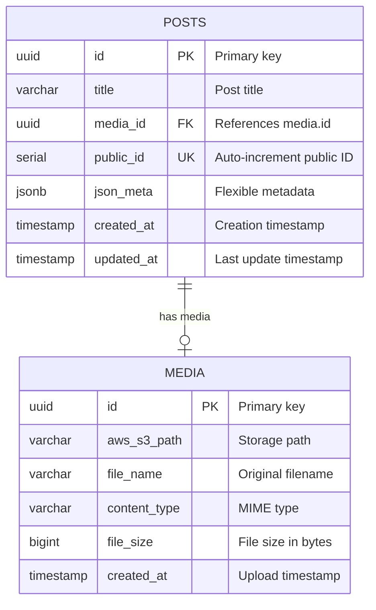

# Database Design & Documentation

## Overview

DockerX uses **PostgreSQL 15** as the primary database, providing ACID compliance, advanced JSON support, and excellent performance characteristics. The database design follows normalization principles while maintaining flexibility through JSON metadata fields.

## 🗄️ Database Architecture

### **Connection Configuration**

```yaml
Database Server: PostgreSQL 15
Host: localhost (Docker: db container)
Port: 5432
Database: dockerx_db
Username: postgres
Password: postgres123
Connection Pool: 10-100 connections
SSL Mode: Prefer (Production: Require)
```

### **Database Schema Overview**



## 📋 Table Definitions

### **Posts Table**

```sql
CREATE TABLE posts (
    id UUID PRIMARY KEY DEFAULT gen_random_uuid(),
    title VARCHAR(255) NOT NULL,
    media_id UUID REFERENCES media(id) ON DELETE SET NULL,
    public_id SERIAL UNIQUE,
    json_meta JSONB DEFAULT '{}',
    created_at TIMESTAMP WITH TIME ZONE DEFAULT NOW(),
    updated_at TIMESTAMP WITH TIME ZONE DEFAULT NOW()
);

-- Comments
COMMENT ON TABLE posts IS 'Main posts table storing content entries';
COMMENT ON COLUMN posts.id IS 'Unique identifier for internal use';
COMMENT ON COLUMN posts.public_id IS 'Sequential public identifier for URLs';
COMMENT ON COLUMN posts.json_meta IS 'Flexible metadata storage (tags, author, etc.)';
```

**Field Details**:

| Field | Type | Constraints | Description |
|-------|------|-------------|-------------|
| `id` | UUID | PRIMARY KEY, NOT NULL | Internal unique identifier |
| `title` | VARCHAR(255) | NOT NULL | Post title |
| `media_id` | UUID | FOREIGN KEY, NULLABLE | Reference to media table |
| `public_id` | SERIAL | UNIQUE, NOT NULL | Sequential public identifier |
| `json_meta` | JSONB | DEFAULT '{}' | Flexible metadata storage |
| `created_at` | TIMESTAMP WITH TIME ZONE | DEFAULT NOW() | Creation timestamp |
| `updated_at` | TIMESTAMP WITH TIME ZONE | DEFAULT NOW() | Last modification timestamp |

### **Media Table**

```sql
CREATE TABLE media (
    id UUID PRIMARY KEY DEFAULT gen_random_uuid(),
    aws_s3_path VARCHAR(500) NOT NULL,
    file_name VARCHAR(255),
    content_type VARCHAR(100),
    file_size BIGINT,
    created_at TIMESTAMP WITH TIME ZONE DEFAULT NOW()
);

-- Comments
COMMENT ON TABLE media IS 'Media files metadata and storage information';
COMMENT ON COLUMN media.aws_s3_path IS 'Storage path (S3, Azure, or local)';
COMMENT ON COLUMN media.file_name IS 'Original uploaded filename';
COMMENT ON COLUMN media.content_type IS 'MIME type of the file';
COMMENT ON COLUMN media.file_size IS 'File size in bytes';
```

**Field Details**:

| Field | Type | Constraints | Description |
|-------|------|-------------|-------------|
| `id` | UUID | PRIMARY KEY, NOT NULL | Unique media identifier |
| `aws_s3_path` | VARCHAR(500) | NOT NULL | Storage path/URL |
| `file_name` | VARCHAR(255) | NULLABLE | Original filename |
| `content_type` | VARCHAR(100) | NULLABLE | MIME type |
| `file_size` | BIGINT | NULLABLE | File size in bytes |
| `created_at` | TIMESTAMP WITH TIME ZONE | DEFAULT NOW() | Upload timestamp |

## 🔗 Relationships & Constraints

### **Foreign Key Relationships**

```sql
-- Posts to Media relationship
ALTER TABLE posts 
ADD CONSTRAINT fk_posts_media 
FOREIGN KEY (media_id) REFERENCES media(id) 
ON DELETE SET NULL;

-- Relationship Details:
-- - One-to-One: Each post can have at most one media file
-- - Optional: Posts can exist without media (media_id can be NULL)
-- - Cascade: If media is deleted, media_id is set to NULL
```

### **Indexes for Performance**

```sql
-- Primary indexes (automatically created)
-- posts.id (PRIMARY KEY)
-- media.id (PRIMARY KEY)
-- posts.public_id (UNIQUE)

-- Performance indexes
CREATE INDEX idx_posts_public_id ON posts(public_id);
CREATE INDEX idx_posts_created_at ON posts(created_at DESC);
CREATE INDEX idx_posts_updated_at ON posts(updated_at DESC);
CREATE INDEX idx_posts_media_id ON posts(media_id);
CREATE INDEX idx_media_s3_path ON media(aws_s3_path);
CREATE INDEX idx_media_created_at ON media(created_at DESC);

-- JSON metadata indexes
CREATE INDEX idx_posts_json_meta_gin ON posts USING GIN(json_meta);
CREATE INDEX idx_posts_json_meta_tags ON posts USING GIN((json_meta->'tags'));
CREATE INDEX idx_posts_json_meta_category ON posts((json_meta->>'category'));

-- Composite indexes for common queries
CREATE INDEX idx_posts_created_media ON posts(created_at DESC, media_id);
CREATE INDEX idx_posts_title_search ON posts USING GIN(to_tsvector('english', title));
```

### **Check Constraints**

```sql
-- Data validation constraints
ALTER TABLE posts ADD CONSTRAINT chk_posts_title_length 
    CHECK (LENGTH(title) >= 1 AND LENGTH(title) <= 255);

ALTER TABLE posts ADD CONSTRAINT chk_posts_valid_timestamps 
    CHECK (updated_at >= created_at);

ALTER TABLE media ADD CONSTRAINT chk_media_file_size_positive 
    CHECK (file_size IS NULL OR file_size > 0);

ALTER TABLE media ADD CONSTRAINT chk_media_content_type_format 
    CHECK (content_type IS NULL OR content_type ~ '^[a-z]+/[a-z0-9][a-z0-9\-\.\+]*$');
```

## 🔄 Database Migrations

### **Initial Schema Migration**

```sql
-- Migration: 001_create_initial_schema.sql
-- Description: Creates the initial database schema

-- Enable UUID extension
CREATE EXTENSION IF NOT EXISTS "pgcrypto";

-- Create media table first (referenced by posts)
CREATE TABLE media (
    id UUID PRIMARY KEY DEFAULT gen_random_uuid(),
    aws_s3_path VARCHAR(500) NOT NULL,
    file_name VARCHAR(255),
    content_type VARCHAR(100),
    file_size BIGINT,
    created_at TIMESTAMP WITH TIME ZONE DEFAULT NOW()
);

-- Create posts table
CREATE TABLE posts (
    id UUID PRIMARY KEY DEFAULT gen_random_uuid(),
    title VARCHAR(255) NOT NULL,
    media_id UUID REFERENCES media(id) ON DELETE SET NULL,
    public_id SERIAL UNIQUE,
    json_meta JSONB DEFAULT '{}',
    created_at TIMESTAMP WITH TIME ZONE DEFAULT NOW(),
    updated_at TIMESTAMP WITH TIME ZONE DEFAULT NOW()
);

-- Create indexes
CREATE INDEX idx_posts_public_id ON posts(public_id);
CREATE INDEX idx_posts_created_at ON posts(created_at DESC);
CREATE INDEX idx_posts_media_id ON posts(media_id);
CREATE INDEX idx_media_s3_path ON media(aws_s3_path);
CREATE INDEX idx_posts_json_meta_gin ON posts USING GIN(json_meta);

-- Add constraints
ALTER TABLE posts ADD CONSTRAINT chk_posts_title_length 
    CHECK (LENGTH(title) >= 1 AND LENGTH(title) <= 255);
```

### **Update Triggers**

```sql
-- Auto-update updated_at timestamp
CREATE OR REPLACE FUNCTION update_updated_at_column()
RETURNS TRIGGER AS $$
BEGIN
    NEW.updated_at = NOW();
    RETURN NEW;
END;
$$ language 'plpgsql';

CREATE TRIGGER update_posts_updated_at 
    BEFORE UPDATE ON posts 
    FOR EACH ROW 
    EXECUTE FUNCTION update_updated_at_column();
```

### **Seed Data**

```sql
-- Migration: 002_seed_data.sql
-- Description: Insert sample data for development

-- Insert sample media
INSERT INTO media (id, aws_s3_path, file_name, content_type, file_size) VALUES
('550e8400-e29b-41d4-a716-446655440001', 'uploads/sample1.jpg', 'sample1.jpg', 'image/jpeg', 102400),
('550e8400-e29b-41d4-a716-446655440002', 'uploads/sample2.png', 'sample2.png', 'image/png', 204800);

-- Insert sample posts
INSERT INTO posts (id, title, media_id, json_meta) VALUES
(
    '550e8400-e29b-41d4-a716-446655440003',
    'Welcome to DockerX',
    '550e8400-e29b-41d4-a716-446655440001',
    '{"tags": ["welcome", "introduction"], "author": "System", "featured": true}'
),
(
    '550e8400-e29b-41d4-a716-446655440004',
    'Getting Started with the Platform',
    '550e8400-e29b-41d4-a716-446655440002',
    '{"tags": ["tutorial", "guide"], "author": "Admin", "category": "documentation"}'
);
```

## 📊 Data Management

### **Common Queries**

#### **Get All Posts with Media**

```sql
SELECT 
    p.id,
    p.title,
    p.public_id,
    p.json_meta,
    p.created_at,
    p.updated_at,
    m.aws_s3_path,
    m.file_name,
    m.content_type
FROM posts p
LEFT JOIN media m ON p.media_id = m.id
ORDER BY p.created_at DESC;
```

#### **Get Posts with Pagination**

```sql
SELECT 
    p.*,
    m.aws_s3_path as media_url
FROM posts p
LEFT JOIN media m ON p.media_id = m.id
ORDER BY p.created_at DESC
LIMIT $1 OFFSET $2;

-- Count query for pagination
SELECT COUNT(*) FROM posts;
```

#### **Search Posts by Tag**

```sql
SELECT p.*, m.aws_s3_path
FROM posts p
LEFT JOIN media m ON p.media_id = m.id
WHERE p.json_meta->'tags' ? $1  -- $1 = tag name
ORDER BY p.created_at DESC;
```

#### **Search Posts by Category**

```sql
SELECT p.*, m.aws_s3_path
FROM posts p
LEFT JOIN media m ON p.media_id = m.id
WHERE p.json_meta->>'category' = $1  -- $1 = category name
ORDER BY p.created_at DESC;
```

#### **Full-Text Search**

```sql
SELECT p.*, m.aws_s3_path,
       ts_rank(to_tsvector('english', p.title), plainto_tsquery('english', $1)) as rank
FROM posts p
LEFT JOIN media m ON p.media_id = m.id
WHERE to_tsvector('english', p.title) @@ plainto_tsquery('english', $1)
ORDER BY rank DESC, p.created_at DESC;
```

### **Data Maintenance Queries**

#### **Cleanup Orphaned Media**

```sql
-- Find media files not referenced by any post
SELECT m.*
FROM media m
LEFT JOIN posts p ON p.media_id = m.id
WHERE p.id IS NULL;

-- Delete orphaned media (be careful!)
DELETE FROM media m
WHERE NOT EXISTS (
    SELECT 1 FROM posts p WHERE p.media_id = m.id
);
```

#### **Update Timestamps**

```sql
-- Manual timestamp update (trigger handles this automatically)
UPDATE posts 
SET updated_at = NOW() 
WHERE id = $1;
```

#### **Bulk Operations**

```sql
-- Bulk update category
UPDATE posts 
SET json_meta = jsonb_set(json_meta, '{category}', '"technology"')
WHERE json_meta->>'category' IS NULL;

-- Bulk add tags
UPDATE posts 
SET json_meta = jsonb_set(
    json_meta, 
    '{tags}', 
    COALESCE(json_meta->'tags', '[]'::jsonb) || '["migrated"]'::jsonb
)
WHERE created_at < '2024-01-01';
```

## 🔒 Security Considerations

### **Access Control**

```sql
-- Create application user with limited permissions
CREATE USER dockerx_app WITH PASSWORD 'app_password_here';

-- Grant necessary permissions
GRANT CONNECT ON DATABASE dockerx_db TO dockerx_app;
GRANT USAGE ON SCHEMA public TO dockerx_app;
GRANT SELECT, INSERT, UPDATE, DELETE ON posts, media TO dockerx_app;
GRANT USAGE, SELECT ON ALL SEQUENCES IN SCHEMA public TO dockerx_app;

-- Revoke dangerous permissions
REVOKE CREATE ON SCHEMA public FROM PUBLIC;
REVOKE ALL ON SCHEMA information_schema FROM dockerx_app;
REVOKE ALL ON SCHEMA pg_catalog FROM dockerx_app;
```

### **Data Protection**

```sql
-- Enable row-level security (future feature)
ALTER TABLE posts ENABLE ROW LEVEL SECURITY;
ALTER TABLE media ENABLE ROW LEVEL SECURITY;

-- Create policies for multi-tenancy (future)
CREATE POLICY posts_isolation ON posts
    USING (json_meta->>'tenant_id' = current_setting('app.current_tenant_id'));
```

### **Audit Trail**

```sql
-- Create audit table
CREATE TABLE audit_log (
    id UUID PRIMARY KEY DEFAULT gen_random_uuid(),
    table_name VARCHAR(50) NOT NULL,
    record_id UUID NOT NULL,
    operation VARCHAR(10) NOT NULL, -- INSERT, UPDATE, DELETE
    old_data JSONB,
    new_data JSONB,
    user_id VARCHAR(100),
    timestamp TIMESTAMP WITH TIME ZONE DEFAULT NOW()
);

-- Audit trigger function
CREATE OR REPLACE FUNCTION audit_trigger_function()
RETURNS TRIGGER AS $$
BEGIN
    IF TG_OP = 'INSERT' THEN
        INSERT INTO audit_log (table_name, record_id, operation, new_data)
        VALUES (TG_TABLE_NAME, NEW.id, TG_OP, row_to_json(NEW));
        RETURN NEW;
    ELSIF TG_OP = 'UPDATE' THEN
        INSERT INTO audit_log (table_name, record_id, operation, old_data, new_data)
        VALUES (TG_TABLE_NAME, NEW.id, TG_OP, row_to_json(OLD), row_to_json(NEW));
        RETURN NEW;
    ELSIF TG_OP = 'DELETE' THEN
        INSERT INTO audit_log (table_name, record_id, operation, old_data)
        VALUES (TG_TABLE_NAME, OLD.id, TG_OP, row_to_json(OLD));
        RETURN OLD;
    END IF;
    RETURN NULL;
END;
$$ language 'plpgsql';

-- Apply audit triggers
CREATE TRIGGER audit_posts AFTER INSERT OR UPDATE OR DELETE ON posts
    FOR EACH ROW EXECUTE FUNCTION audit_trigger_function();

CREATE TRIGGER audit_media AFTER INSERT OR UPDATE OR DELETE ON media
    FOR EACH ROW EXECUTE FUNCTION audit_trigger_function();
```

## 📈 Performance Optimization

### **Query Performance**

```sql
-- Analyze query performance
EXPLAIN (ANALYZE, BUFFERS) 
SELECT p.*, m.aws_s3_path
FROM posts p
LEFT JOIN media m ON p.media_id = m.id
WHERE p.created_at > NOW() - INTERVAL '30 days'
ORDER BY p.created_at DESC
LIMIT 20;
```

### **Index Maintenance**

```sql
-- Monitor index usage
SELECT 
    schemaname,
    tablename,
    indexname,
    idx_scan as index_scans,
    idx_tup_read as tuples_read,
    idx_tup_fetch as tuples_fetched
FROM pg_stat_user_indexes
ORDER BY idx_scan DESC;

-- Rebuild indexes if needed
REINDEX INDEX idx_posts_created_at;
```

### **Database Statistics**

```sql
-- Update table statistics
ANALYZE posts;
ANALYZE media;

-- Check table sizes
SELECT 
    tablename,
    pg_size_pretty(pg_total_relation_size(schemaname||'.'||tablename)) as size
FROM pg_tables 
WHERE schemaname = 'public';
```

## 🔧 Backup & Recovery

### **Backup Strategy**

```bash
# Full database backup
pg_dump -h localhost -U postgres -d dockerx_db > backup_$(date +%Y%m%d).sql

# Schema-only backup
pg_dump -h localhost -U postgres -d dockerx_db --schema-only > schema_backup.sql

# Data-only backup
pg_dump -h localhost -U postgres -d dockerx_db --data-only > data_backup.sql

# Compressed backup
pg_dump -h localhost -U postgres -d dockerx_db | gzip > backup_$(date +%Y%m%d).sql.gz
```

### **Recovery Procedures**

```bash
# Restore from backup
psql -h localhost -U postgres -d dockerx_db < backup_20240115.sql

# Restore compressed backup
gunzip -c backup_20240115.sql.gz | psql -h localhost -U postgres -d dockerx_db
```

## 📊 Monitoring & Maintenance

### **Health Checks**

```sql
-- Check database connectivity
SELECT 1;

-- Check table health
SELECT 
    tablename,
    n_tup_ins as inserts,
    n_tup_upd as updates,
    n_tup_del as deletes,
    n_live_tup as live_tuples,
    n_dead_tup as dead_tuples
FROM pg_stat_user_tables;

-- Check database size
SELECT pg_size_pretty(pg_database_size('dockerx_db'));
```

### **Maintenance Tasks**

```sql
-- Vacuum tables
VACUUM ANALYZE posts;
VACUUM ANALYZE media;

-- Auto-vacuum settings (postgresql.conf)
-- autovacuum = on
-- autovacuum_vacuum_threshold = 50
-- autovacuum_analyze_threshold = 50
```

This comprehensive database documentation provides everything needed to understand, maintain, and optimize the DockerX database infrastructure. 