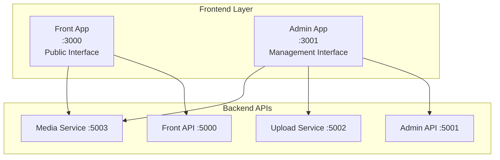

# Frontend Applications Documentation

## Overview

DockerX features two Next.js 15 applications built with TypeScript and Tailwind CSS, providing modern, responsive user interfaces for both public content consumption and administrative management.

## 🌐 Application Architecture

### **Frontend Stack**

| Technology | Version | Purpose |
|------------|---------|---------|
| **Next.js** | 15.x | React framework with App Router |
| **TypeScript** | 5.x | Type-safe development |
| **Tailwind CSS** | 3.x | Utility-first styling |
| **React** | 18.x | UI component library |
| **Node.js** | 18+ | Runtime environment |

### **Applications Overview**



## 🎨 Front App (Public Interface)

**Port**: 3000  
**Purpose**: Public-facing interface for content consumption  
**Path**: `src/front/`

### **Architecture Overview**

```typescript
src/front/
├── src/
│   ├── app/                    # App Router pages
│   │   ├── globals.css         # Global styles
│   │   ├── layout.tsx          # Root layout
│   │   ├── page.tsx            # Homepage
│   │   └── posts/
│   │       └── [id]/
│   │           └── page.tsx    # Post detail page
│   ├── components/             # Reusable components
│   │   ├── ui/                 # Base UI components
│   │   ├── PostCard.tsx        # Post display component
│   │   ├── Header.tsx          # Site header
│   │   └── Footer.tsx          # Site footer
│   ├── lib/                    # Utilities and configs
│   │   ├── api.ts              # API client
│   │   ├── utils.ts            # Helper functions
│   │   └── constants.ts        # App constants
│   └── types/                  # TypeScript definitions
│       └── index.ts            # Type definitions
├── public/                     # Static assets
├── next.config.js              # Next.js configuration
├── tailwind.config.js          # Tailwind configuration
├── tsconfig.json              # TypeScript configuration
└── package.json               # Dependencies
```

### **Key Components**

#### **Homepage (app/page.tsx)**

```typescript
import { Suspense } from 'react';
import PostCard from '@/components/PostCard';
import { Post } from '@/types';

async function getPosts(): Promise<Post[]> {
  const response = await fetch('http://localhost:5000/api/posts', {
    cache: 'no-store', // Always fetch fresh data
  });
  
  if (!response.ok) {
    throw new Error('Failed to fetch posts');
  }
  
  const data = await response.json();
  return data.data || [];
}

export default async function HomePage() {
  const posts = await getPosts();

  return (
    <div className="min-h-screen bg-gray-50">
      <div className="container mx-auto px-4 py-8">
        <h1 className="text-4xl font-bold text-center mb-8">
          Welcome to DockerX
        </h1>
        
        <div className="grid grid-cols-1 md:grid-cols-2 lg:grid-cols-3 gap-6">
          {posts.map((post) => (
            <Suspense key={post.id} fallback={<PostCardSkeleton />}>
              <PostCard post={post} />
            </Suspense>
          ))}
        </div>
        
        {posts.length === 0 && (
          <div className="text-center text-gray-500 mt-12">
            <p className="text-xl">No posts available yet.</p>
            <p className="mt-2">Check back later for content!</p>
          </div>
        )}
      </div>
    </div>
  );
}
```

#### **PostCard Component**

```typescript
// components/PostCard.tsx
import Image from 'next/image';
import Link from 'next/link';
import { Post } from '@/types';

interface PostCardProps {
  post: Post;
}

export default function PostCard({ post }: PostCardProps) {
  return (
    <div className="bg-white rounded-lg shadow-md overflow-hidden hover:shadow-lg transition-shadow duration-300">
      {post.mediaUrl && (
        <div className="relative h-48 w-full">
          <Image
            src={post.mediaUrl}
            alt={post.title}
            fill
            className="object-cover"
            sizes="(max-width: 768px) 100vw, (max-width: 1200px) 50vw, 33vw"
          />
        </div>
      )}
      
      <div className="p-6">
        <h2 className="text-xl font-semibold text-gray-900 mb-2">
          {post.title}
        </h2>
        
        <div className="flex items-center justify-between text-sm text-gray-500 mb-4">
          <span>Post #{post.publicId}</span>
          <time dateTime={post.createdAt}>
            {new Date(post.createdAt).toLocaleDateString()}
          </time>
        </div>
        
        {post.jsonMeta?.tags && (
          <div className="flex flex-wrap gap-2 mb-4">
            {post.jsonMeta.tags.map((tag: string) => (
              <span
                key={tag}
                className="inline-block bg-blue-100 text-blue-800 text-xs px-2 py-1 rounded-full"
              >
                {tag}
              </span>
            ))}
          </div>
        )}
        
        <Link
          href={`/posts/${post.id}`}
          className="inline-block bg-blue-600 text-white px-4 py-2 rounded-md hover:bg-blue-700 transition-colors duration-200"
        >
          Read More
        </Link>
      </div>
    </div>
  );
}
```

#### **Post Detail Page**

```typescript
// app/posts/[id]/page.tsx
import Image from 'next/image';
import { notFound } from 'next/navigation';
import { Post } from '@/types';

async function getPost(id: string): Promise<Post | null> {
  try {
    const response = await fetch(`http://localhost:5000/api/posts/${id}`, {
      cache: 'no-store',
    });
    
    if (!response.ok) {
      return null;
    }
    
    const data = await response.json();
    return data.data;
  } catch (error) {
    return null;
  }
}

export default async function PostPage({ params }: { params: { id: string } }) {
  const post = await getPost(params.id);
  
  if (!post) {
    notFound();
  }

  return (
    <article className="min-h-screen bg-gray-50">
      <div className="container mx-auto px-4 py-8">
        <div className="max-w-4xl mx-auto bg-white rounded-lg shadow-lg overflow-hidden">
          {post.mediaUrl && (
            <div className="relative h-96 w-full">
              <Image
                src={post.mediaUrl}
                alt={post.title}
                fill
                className="object-cover"
                priority
              />
            </div>
          )}
          
          <div className="p-8">
            <h1 className="text-4xl font-bold text-gray-900 mb-4">
              {post.title}
            </h1>
            
            <div className="flex items-center justify-between text-gray-600 mb-6">
              <span>Post #{post.publicId}</span>
              <time dateTime={post.createdAt}>
                {new Date(post.createdAt).toLocaleDateString('en-US', {
                  year: 'numeric',
                  month: 'long',
                  day: 'numeric',
                })}
              </time>
            </div>
            
            {post.jsonMeta?.category && (
              <p className="text-lg text-gray-700 mb-4">
                Category: <span className="font-semibold">{post.jsonMeta.category}</span>
              </p>
            )}
            
            {post.jsonMeta?.tags && (
              <div className="flex flex-wrap gap-2 mb-6">
                {post.jsonMeta.tags.map((tag: string) => (
                  <span
                    key={tag}
                    className="bg-blue-100 text-blue-800 px-3 py-1 rounded-full text-sm"
                  >
                    {tag}
                  </span>
                ))}
              </div>
            )}
            
            {post.jsonMeta?.description && (
              <div className="prose max-w-none">
                <p className="text-lg leading-relaxed text-gray-700">
                  {post.jsonMeta.description}
                </p>
              </div>
            )}
          </div>
        </div>
      </div>
    </article>
  );
}
```

### **Configuration**

#### **Next.js Configuration**

```javascript
// next.config.js
/** @type {import('next').NextConfig} */
const nextConfig = {
  images: {
    remotePatterns: [
      {
        protocol: 'http',
        hostname: 'localhost',
        port: '5003',
        pathname: '/api/media/**',
      },
    ],
  },
  async rewrites() {
    return [
      {
        source: '/api/:path*',
        destination: 'http://localhost:5000/api/:path*',
      },
    ];
  },
};

module.exports = nextConfig;
```

## 🔐 Admin App (Management Interface)

**Port**: 3001  
**Purpose**: Administrative interface for content management  
**Path**: `src/admin/`

### **Architecture Overview**

```typescript
src/admin/
├── src/
│   ├── app/                    # App Router pages
│   │   ├── globals.css         # Global styles
│   │   ├── layout.tsx          # Root layout with auth
│   │   ├── page.tsx            # Dashboard homepage
│   │   ├── login/
│   │   │   └── page.tsx        # Login page
│   │   └── posts/
│   │       ├── page.tsx        # Posts management
│   │       ├── create/
│   │       │   └── page.tsx    # Create post
│   │       └── [id]/
│   │           └── edit/
│   │               └── page.tsx # Edit post
│   ├── components/             # Admin components
│   │   ├── ui/                 # Base UI components
│   │   ├── LoginForm.tsx       # Authentication form
│   │   ├── PostForm.tsx        # Post creation/editing
│   │   ├── PostList.tsx        # Posts table
│   │   ├── Sidebar.tsx         # Navigation sidebar
│   │   └── Header.tsx          # Admin header
│   ├── lib/                    # Utilities
│   │   ├── auth.ts             # Authentication logic
│   │   ├── api.ts              # API client with auth
│   │   └── utils.ts            # Helper functions
│   └── types/                  # TypeScript definitions
│       └── index.ts            # Admin-specific types
├── middleware.ts               # Authentication middleware
└── ...configuration files
```

### **Authentication System**

#### **Authentication Library**

```typescript
// lib/auth.ts
import { jwtDecode } from 'jwt-decode';

interface AuthTokens {
  token: string;
  expiresAt: string;
  username: string;
}

interface JWTPayload {
  sub: string;
  exp: number;
  iss: string;
  aud: string;
}

export class AuthService {
  private static readonly TOKEN_KEY = 'dockerx_admin_token';
  private static readonly USER_KEY = 'dockerx_admin_user';

  static async login(username: string, password: string): Promise<boolean> {
    try {
      const response = await fetch('http://localhost:5001/api/auth/login', {
        method: 'POST',
        headers: {
          'Content-Type': 'application/json',
        },
        body: JSON.stringify({ username, password }),
      });

      if (!response.ok) {
        throw new Error('Login failed');
      }

      const data: AuthTokens = await response.json();
      
      localStorage.setItem(this.TOKEN_KEY, data.token);
      localStorage.setItem(this.USER_KEY, data.username);
      
      return true;
    } catch (error) {
      console.error('Login error:', error);
      return false;
    }
  }

  static logout(): void {
    localStorage.removeItem(this.TOKEN_KEY);
    localStorage.removeItem(this.USER_KEY);
    window.location.href = '/login';
  }

  static getToken(): string | null {
    if (typeof window === 'undefined') return null;
    return localStorage.getItem(this.TOKEN_KEY);
  }

  static getUser(): string | null {
    if (typeof window === 'undefined') return null;
    return localStorage.getItem(this.USER_KEY);
  }

  static isAuthenticated(): boolean {
    const token = this.getToken();
    if (!token) return false;

    try {
      const decoded: JWTPayload = jwtDecode(token);
      const now = Date.now() / 1000;
      return decoded.exp > now;
    } catch {
      return false;
    }
  }

  static getAuthHeaders(): HeadersInit {
    const token = this.getToken();
    return token ? { Authorization: `Bearer ${token}` } : {};
  }
}
```

#### **Authentication Middleware**

```typescript
// middleware.ts
import { NextResponse } from 'next/server';
import type { NextRequest } from 'next/server';

export function middleware(request: NextRequest) {
  // Check if user is on login page
  if (request.nextUrl.pathname === '/login') {
    return NextResponse.next();
  }

  // Check for authentication token
  const token = request.cookies.get('auth-token')?.value;
  
  if (!token) {
    return NextResponse.redirect(new URL('/login', request.url));
  }

  // Validate token (basic check - full validation happens server-side)
  try {
    const payload = JSON.parse(atob(token.split('.')[1]));
    const now = Date.now() / 1000;
    
    if (payload.exp <= now) {
      return NextResponse.redirect(new URL('/login', request.url));
    }
  } catch {
    return NextResponse.redirect(new URL('/login', request.url));
  }

  return NextResponse.next();
}

export const config = {
  matcher: ['/((?!api|_next/static|_next/image|favicon.ico|login).*)'],
};
```

### **Key Admin Components**

#### **Login Form**

```typescript
// components/LoginForm.tsx
'use client';

import { useState } from 'react';
import { useRouter } from 'next/navigation';
import { AuthService } from '@/lib/auth';

export default function LoginForm() {
  const [credentials, setCredentials] = useState({
    username: '',
    password: ''
  });
  const [isLoading, setIsLoading] = useState(false);
  const [error, setError] = useState('');
  const router = useRouter();

  const handleSubmit = async (e: React.FormEvent) => {
    e.preventDefault();
    setIsLoading(true);
    setError('');

    try {
      const success = await AuthService.login(
        credentials.username,
        credentials.password
      );

      if (success) {
        router.push('/');
      } else {
        setError('Invalid username or password');
      }
    } catch (error) {
      setError('Login failed. Please try again.');
    } finally {
      setIsLoading(false);
    }
  };

  return (
    <div className="min-h-screen flex items-center justify-center bg-gray-50">
      <div className="max-w-md w-full space-y-8">
        <div>
          <h2 className="mt-6 text-center text-3xl font-extrabold text-gray-900">
            Admin Login
          </h2>
          <p className="mt-2 text-center text-sm text-gray-600">
            Sign in to your admin account
          </p>
        </div>
        
        <form className="mt-8 space-y-6" onSubmit={handleSubmit}>
          {error && (
            <div className="bg-red-100 border border-red-400 text-red-700 px-4 py-3 rounded">
              {error}
            </div>
          )}
          
          <div className="space-y-4">
            <div>
              <label htmlFor="username" className="sr-only">
                Username
              </label>
              <input
                id="username"
                name="username"
                type="text"
                required
                className="relative block w-full px-3 py-2 border border-gray-300 placeholder-gray-500 text-gray-900 rounded-md focus:outline-none focus:ring-blue-500 focus:border-blue-500"
                placeholder="Username"
                value={credentials.username}
                onChange={(e) => setCredentials(prev => ({ 
                  ...prev, 
                  username: e.target.value 
                }))}
              />
            </div>
            
            <div>
              <label htmlFor="password" className="sr-only">
                Password
              </label>
              <input
                id="password"
                name="password"
                type="password"
                required
                className="relative block w-full px-3 py-2 border border-gray-300 placeholder-gray-500 text-gray-900 rounded-md focus:outline-none focus:ring-blue-500 focus:border-blue-500"
                placeholder="Password"
                value={credentials.password}
                onChange={(e) => setCredentials(prev => ({ 
                  ...prev, 
                  password: e.target.value 
                }))}
              />
            </div>
          </div>

          <div>
            <button
              type="submit"
              disabled={isLoading}
              className="group relative w-full flex justify-center py-2 px-4 border border-transparent text-sm font-medium rounded-md text-white bg-blue-600 hover:bg-blue-700 focus:outline-none focus:ring-2 focus:ring-offset-2 focus:ring-blue-500 disabled:opacity-50"
            >
              {isLoading ? 'Signing in...' : 'Sign in'}
            </button>
          </div>
          
          <div className="text-center">
            <p className="text-sm text-gray-600">
              Default credentials: admin / admin123
            </p>
          </div>
        </form>
      </div>
    </div>
  );
}
```

#### **Post Management Form**

```typescript
// components/PostForm.tsx
'use client';

import { useState } from 'react';
import { useRouter } from 'next/navigation';
import { AuthService } from '@/lib/auth';
import { Post } from '@/types';

interface PostFormProps {
  post?: Post;
  mode: 'create' | 'edit';
}

export default function PostForm({ post, mode }: PostFormProps) {
  const [formData, setFormData] = useState({
    title: post?.title || '',
    category: post?.jsonMeta?.category || '',
    tags: post?.jsonMeta?.tags?.join(', ') || '',
    description: post?.jsonMeta?.description || '',
  });
  const [file, setFile] = useState<File | null>(null);
  const [isLoading, setIsLoading] = useState(false);
  const [error, setError] = useState('');
  const router = useRouter();

  const handleSubmit = async (e: React.FormEvent) => {
    e.preventDefault();
    setIsLoading(true);
    setError('');

    try {
      const formDataToSend = new FormData();
      formDataToSend.append('title', formData.title);
      
      const jsonMeta = {
        category: formData.category,
        tags: formData.tags.split(',').map(tag => tag.trim()).filter(Boolean),
        description: formData.description,
      };
      formDataToSend.append('jsonMeta', JSON.stringify(jsonMeta));
      
      if (file) {
        formDataToSend.append('file', file);
      }

      const url = mode === 'create' 
        ? 'http://localhost:5001/api/adminposts'
        : `http://localhost:5001/api/adminposts/${post?.id}`;
      
      const method = mode === 'create' ? 'POST' : 'PUT';

      const response = await fetch(url, {
        method,
        headers: AuthService.getAuthHeaders(),
        body: formDataToSend,
      });

      if (!response.ok) {
        throw new Error(`${mode === 'create' ? 'Creation' : 'Update'} failed`);
      }

      router.push('/posts');
    } catch (error) {
      setError(`Failed to ${mode} post. Please try again.`);
    } finally {
      setIsLoading(false);
    }
  };

  return (
    <div className="max-w-2xl mx-auto">
      <h1 className="text-3xl font-bold text-gray-900 mb-8">
        {mode === 'create' ? 'Create New Post' : 'Edit Post'}
      </h1>

      <form onSubmit={handleSubmit} className="space-y-6">
        {error && (
          <div className="bg-red-100 border border-red-400 text-red-700 px-4 py-3 rounded">
            {error}
          </div>
        )}

        <div>
          <label htmlFor="title" className="block text-sm font-medium text-gray-700">
            Title *
          </label>
          <input
            type="text"
            id="title"
            required
            className="mt-1 block w-full px-3 py-2 border border-gray-300 rounded-md shadow-sm focus:outline-none focus:ring-blue-500 focus:border-blue-500"
            value={formData.title}
            onChange={(e) => setFormData(prev => ({ ...prev, title: e.target.value }))}
          />
        </div>

        <div>
          <label htmlFor="category" className="block text-sm font-medium text-gray-700">
            Category
          </label>
          <input
            type="text"
            id="category"
            className="mt-1 block w-full px-3 py-2 border border-gray-300 rounded-md shadow-sm focus:outline-none focus:ring-blue-500 focus:border-blue-500"
            value={formData.category}
            onChange={(e) => setFormData(prev => ({ ...prev, category: e.target.value }))}
          />
        </div>

        <div>
          <label htmlFor="tags" className="block text-sm font-medium text-gray-700">
            Tags (comma-separated)
          </label>
          <input
            type="text"
            id="tags"
            placeholder="technology, programming, tutorial"
            className="mt-1 block w-full px-3 py-2 border border-gray-300 rounded-md shadow-sm focus:outline-none focus:ring-blue-500 focus:border-blue-500"
            value={formData.tags}
            onChange={(e) => setFormData(prev => ({ ...prev, tags: e.target.value }))}
          />
        </div>

        <div>
          <label htmlFor="description" className="block text-sm font-medium text-gray-700">
            Description
          </label>
          <textarea
            id="description"
            rows={4}
            className="mt-1 block w-full px-3 py-2 border border-gray-300 rounded-md shadow-sm focus:outline-none focus:ring-blue-500 focus:border-blue-500"
            value={formData.description}
            onChange={(e) => setFormData(prev => ({ ...prev, description: e.target.value }))}
          />
        </div>

        <div>
          <label htmlFor="file" className="block text-sm font-medium text-gray-700">
            {mode === 'create' ? 'Image' : 'New Image (optional)'}
          </label>
          <input
            type="file"
            id="file"
            accept="image/*"
            className="mt-1 block w-full px-3 py-2 border border-gray-300 rounded-md shadow-sm focus:outline-none focus:ring-blue-500 focus:border-blue-500"
            onChange={(e) => setFile(e.target.files?.[0] || null)}
          />
          {mode === 'create' && (
            <p className="mt-1 text-sm text-gray-500">
              Supported formats: JPEG, PNG, GIF, WebP (max 10MB)
            </p>
          )}
        </div>

        <div className="flex gap-4">
          <button
            type="submit"
            disabled={isLoading}
            className="flex-1 bg-blue-600 text-white px-4 py-2 rounded-md hover:bg-blue-700 focus:outline-none focus:ring-2 focus:ring-blue-500 disabled:opacity-50"
          >
            {isLoading ? 'Saving...' : (mode === 'create' ? 'Create Post' : 'Update Post')}
          </button>
          
          <button
            type="button"
            onClick={() => router.push('/posts')}
            className="flex-1 bg-gray-300 text-gray-700 px-4 py-2 rounded-md hover:bg-gray-400 focus:outline-none focus:ring-2 focus:ring-gray-500"
          >
            Cancel
          </button>
        </div>
      </form>
    </div>
  );
}
```

## 🎨 Styling & Design System

### **Tailwind Configuration**

```javascript
// tailwind.config.js
/** @type {import('tailwindcss').Config} */
module.exports = {
  content: [
    './src/pages/**/*.{js,ts,jsx,tsx,mdx}',
    './src/components/**/*.{js,ts,jsx,tsx,mdx}',
    './src/app/**/*.{js,ts,jsx,tsx,mdx}',
  ],
  theme: {
    extend: {
      colors: {
        primary: {
          50: '#eff6ff',
          500: '#3b82f6',
          600: '#2563eb',
          700: '#1d4ed8',
        },
        gray: {
          50: '#f9fafb',
          100: '#f3f4f6',
          500: '#6b7280',
          900: '#111827',
        },
      },
      fontFamily: {
        sans: ['Inter', 'sans-serif'],
      },
    },
  },
  plugins: [
    require('@tailwindcss/forms'),
    require('@tailwindcss/typography'),
  ],
};
```

### **Global Styles**

```css
/* app/globals.css */
@tailwind base;
@tailwind components;
@tailwind utilities;

@layer base {
  html {
    font-family: 'Inter', system-ui, sans-serif;
  }
  
  body {
    @apply bg-gray-50 text-gray-900;
  }
}

@layer components {
  .btn-primary {
    @apply bg-blue-600 text-white px-4 py-2 rounded-md hover:bg-blue-700 focus:outline-none focus:ring-2 focus:ring-blue-500 transition-colors duration-200;
  }
  
  .btn-secondary {
    @apply bg-gray-300 text-gray-700 px-4 py-2 rounded-md hover:bg-gray-400 focus:outline-none focus:ring-2 focus:ring-gray-500 transition-colors duration-200;
  }
  
  .card {
    @apply bg-white rounded-lg shadow-md p-6;
  }
  
  .input-field {
    @apply w-full px-3 py-2 border border-gray-300 rounded-md shadow-sm focus:outline-none focus:ring-blue-500 focus:border-blue-500;
  }
}

@layer utilities {
  .container-custom {
    @apply container mx-auto px-4 sm:px-6 lg:px-8;
  }
}
```

## 📱 Responsive Design

### **Mobile-First Approach**

```typescript
// Responsive grid example
<div className="grid grid-cols-1 sm:grid-cols-2 lg:grid-cols-3 xl:grid-cols-4 gap-6">
  {posts.map(post => (
    <PostCard key={post.id} post={post} />
  ))}
</div>

// Responsive spacing
<div className="p-4 sm:p-6 lg:p-8">
  <h1 className="text-2xl sm:text-3xl lg:text-4xl font-bold">
    Title
  </h1>
</div>

// Responsive navigation
<nav className="hidden md:flex space-x-8">
  <Link href="/">Home</Link>
  <Link href="/posts">Posts</Link>
</nav>
```

### **Breakpoint Strategy**

```yaml
Breakpoints:
  sm: 640px    # Small devices (tablets)
  md: 768px    # Medium devices (small laptops)
  lg: 1024px   # Large devices (desktops)
  xl: 1280px   # Extra large devices
  2xl: 1536px  # Ultra wide screens

Layout Strategy:
  Mobile First: Start with mobile layout
  Progressive Enhancement: Add complexity for larger screens
  Touch Friendly: 44px minimum touch targets
  Performance: Optimize images for different screen densities
```

## ⚡ Performance Optimization

### **Image Optimization**

```typescript
// Next.js Image component usage
import Image from 'next/image';

<Image
  src={post.mediaUrl}
  alt={post.title}
  width={400}
  height={300}
  className="rounded-lg"
  sizes="(max-width: 768px) 100vw, (max-width: 1200px) 50vw, 33vw"
  priority={index < 3} // Load first 3 images immediately
  placeholder="blur"
  blurDataURL="data:image/jpeg;base64,/9j/4AAQSkZJRgABAQ..."
/>
```

### **Loading States**

```typescript
// Skeleton components for loading states
function PostCardSkeleton() {
  return (
    <div className="bg-white rounded-lg shadow-md overflow-hidden animate-pulse">
      <div className="h-48 bg-gray-300"></div>
      <div className="p-6">
        <div className="h-4 bg-gray-300 rounded w-3/4 mb-2"></div>
        <div className="h-4 bg-gray-300 rounded w-1/2 mb-4"></div>
        <div className="h-8 bg-gray-300 rounded w-24"></div>
      </div>
    </div>
  );
}

// Loading boundary
<Suspense fallback={<PostCardSkeleton />}>
  <PostCard post={post} />
</Suspense>
```

### **Code Splitting**

```typescript
// Dynamic imports for large components
import dynamic from 'next/dynamic';

const AdminDashboard = dynamic(() => import('@/components/AdminDashboard'), {
  loading: () => <div>Loading dashboard...</div>,
  ssr: false
});

// Route-based splitting (automatic with App Router)
// Each page in app/ directory is automatically code-split
```

## 🔧 Build & Deployment

### **Build Configuration**

```json
{
  "scripts": {
    "dev": "next dev",
    "build": "next build",
    "start": "next start",
    "lint": "next lint",
    "type-check": "tsc --noEmit"
  }
}
```

### **Production Optimizations**

```javascript
// next.config.js production settings
const nextConfig = {
  // Enable compression
  compress: true,
  
  // Optimize images
  images: {
    formats: ['image/webp', 'image/avif'],
    minimumCacheTTL: 60 * 60 * 24 * 30, // 30 days
  },
  
  // Enable SWC minification
  swcMinify: true,
  
  // Experimental features
  experimental: {
    optimizeCss: true,
    optimizePackageImports: ['@headlessui/react', 'lucide-react'],
  },
};
```

This comprehensive frontend documentation covers both applications' architecture, components, styling, and optimization strategies, providing everything needed for development and maintenance. 